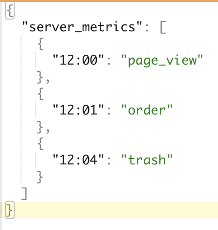
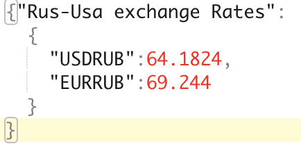
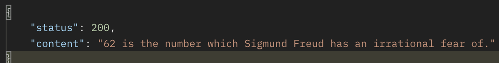

# RK_1
Create venv and install packages:  ```bash script.sh```

## Задачи к рубежному контролю № 1 по ЯП.
1) На вход программы подается текстовый файл, в котором записаны метрики сервиса в виде time:metric. Необходимо написать программу, которая преобразует такие файлы в структуру json вида: 
   
   
	- Написать тесты для программы.
	- Настроить ci/cd на прохождение тестов через github workflows.

2) В вашем распоряжении [веб-сервер](code_tasks/helpers/http_server.py). Необходимо изменить логику обработчика get-запросов таким образом, чтобы сервер выводил курс валют на данный момент в формате json вида:
   

	- api-сервис курса валют: [currate.ru](https://currate.ru) 
	- api-key: `46bb1fe89703cf46a36f8813d3dabc45`
   
3) В вашем распоряжении [веб-сервер](code_tasks/3.py), доработанный таким образом, что он на get-запрос вида http://localhost:8080 возвращает json вида: 
   

	Необходимо преобразовать вывод в html, чтобы в браузере это
	имело вид, к примеру:  
 
    - Рекомендованная библиотека для работы с html: domonic
4) В вашем распоряжении [веб-сервер](code_tasks/helpers/http_server.py), необходимо доработать его таким образом, чтобы если внутри query get-запроса к нему не содержится поля doc-type или doc-type != html или doc-type != json, сервер возвращал `400 Bad request`. В случае если doc-type валидный требуется выводить в соответствующем формате текущее время с точностью до секунды. 

5) В вашем распоряжении [веб-сервер](code_tasks/helpers/http_server.py), в `post-запросе` он должен обрабатывать пароль пользователя и перед сохранением в бд должен валидировать его по вашим правилам. В случае, если пароль не удовлетворяет вашим правилам валидации необходимо возвращать `400 Bad request`. В случае хорошего - `200 OK`

6) Разработчик API СУБД допустил ошибку в реализации скрипта на выгрузку данных. Появление ошибки носит вероятностный характер при обращении к [веб-серверу](code_tasks/6.py) вида: get localhost:8080/?q=some_data. Вам необходимо на уровне обработки http-запроса в случае ошибки на стороне сервера - возвращать `500 Internal Server Error`, в случае, если СУБД отрабатывает нормально - `200 OK`
