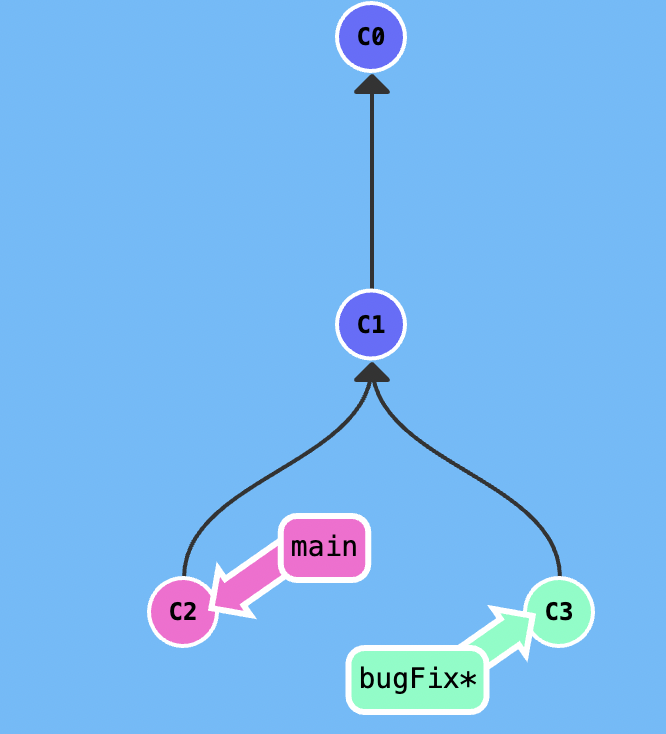
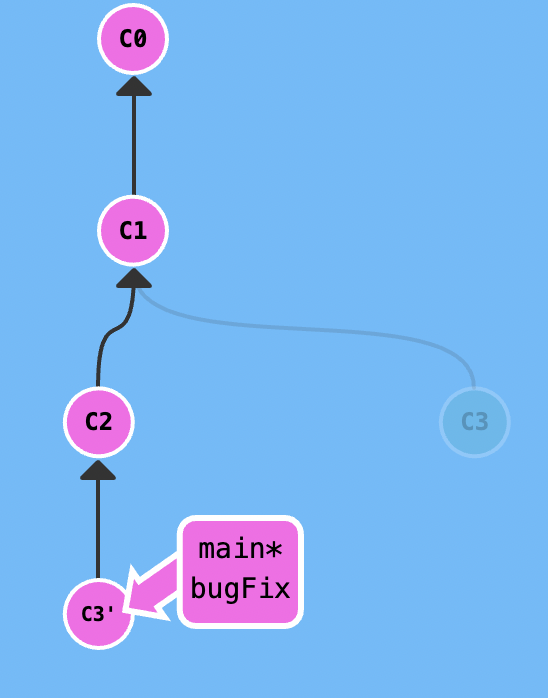

В вашем распоряжении репозиторий с двумя ветками (main, bugFix). 

bugFix и main содержат по одному уникальному коммиту "c3" и "c2" соответственно. Необходимо слить
изменения так, чтобы история коммитов была линейной и выглядела так: 